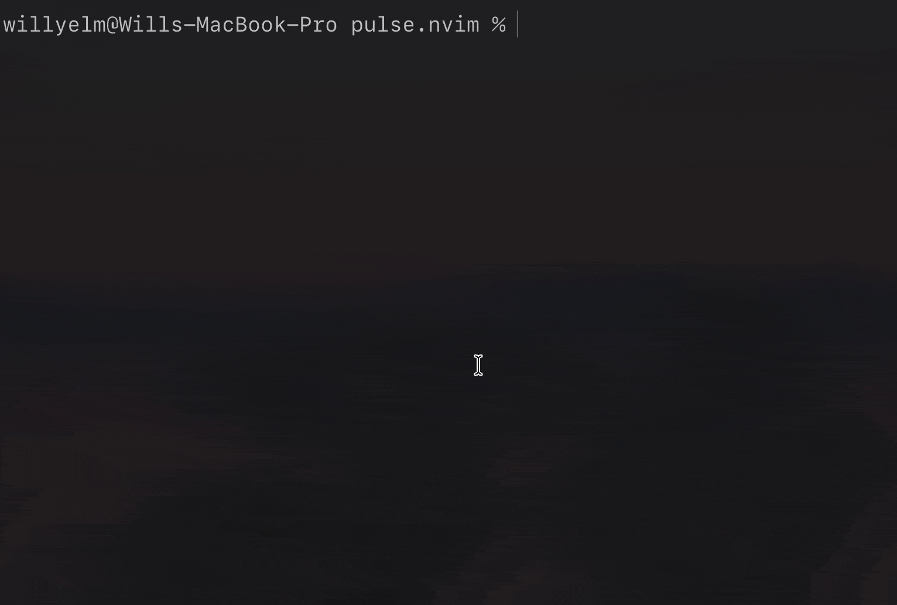

# Pulse.nvim

One entry point. Total focus.



## What is Pulse

A fast command palette for Neovim. Pulse uses a prefix approach to move quickly
between navigator modes:

| Prefix      | Mode                          |
| ----------- | ----------------------------- |
| (no prefix) | files                         |
| `'`         | marks (yours: A-Z and a-z)    |
| `:`         | commands                      |
| `~`         | git                           |
| `$`         | live grep                     |
| `?`         | fuzzy search (current buffer) |
| `@`         | symbols (current buffer)      |
| `#`         | workspace symbols             |
| `!`         | diagnostics                   |
| `>`         | code actions (current buffer) |

For more on the design motivation, see:

- [Engineering with machines](https://willmedina.com/blog/engineering-with-machines)
- [A Single Command Palette for Neovim](https://willmedina.com/blog/pulse-neovim)

## Requirements

- Neovim `>= 0.10`
- `ripgrep` (`rg`)
- `git` (for git panels and previews)
- `nvim-tree/nvim-web-devicons` (optional, recommended)

## Install (vim pack)

```lua
vim.pack.add("https://github.com/willyelm/pulse.nvim")
require("pulse").setup({})
```

## Install (lazy.nvim)

```lua
{
  "willyelm/pulse.nvim",
  dependencies = { "nvim-tree/nvim-web-devicons" },
  opts = {},
}
```

## Setup

```lua
require("pulse").setup({
  cmdline = true, -- Enable experimental ':' cmdline replacement
  position = "top",
  width = 0.70,
  height = 0.90,
  border = "rounded",
  workspace_label = false, -- Show workspace dir in main input
  keys = { fullscreen = "<C-f>" }, -- toggle fullscreen; another key, or false for none
})
```

`keys.fullscreen` is handled inside Pulse's input, so it can't be bound from your own mappings.

## Navigators

Navigators are the different modes you can enter in Pulse. Each navigator has
its own data source, display, and actions.

You can configure which navigators to load and their config options.

**Default navigators** (all loaded if not specified):

- `files` - Project files and opened buffers; `<C-a>` add, `<C-r>` rename, `<C-d>` delete, `<C-c>`/`<C-x>` copy/cut and `<C-v>` paste (add and rename ask with `vim.ui.input`, delete with `confirm()`)
- `marks` - Your marks (`A`-`Z`, plus `a`-`z` in the current buffer); `<C-x>` deletes one
- `commands` - Vim commands
- `git` - Git changes (status, diff, stage, commit, restore), local and remote branches, and project and file history; `<C-c>` opens the commit message as a normal `gitcommit` buffer (`:w` commits, `:q` aborts) and the panel comes back after; on a branch, `<Tab>` and `<CR>` show its aggregate diff against where it split off HEAD (a diffstat, then the changed files themselves, both like a GitHub/GitLab merge request diff rather than a per-commit log), and `<C-o>` checks it out (a remote branch tracks it, creating the local branch the first time)
- `live_grep` - Search with ripgrep
- `fuzzy_search` - Fuzzy search (current buffer)
- `symbols` - Symbols (current buffer)
- `workspace_symbols` - Workspace symbols
- `diagnostics` - LSP diagnostics
- `code_actions` - Code actions (current buffer)

To load a specific set only:

```lua
require("pulse").setup({
  navigators = { "files", "commands", "git" },
})
```

Each navigator can receive its own config directly through `navigators`:

```lua
require("pulse").setup({
  navigators = {
    files = {
      icons = false,
      filters = { "^%.git$", "%.DS_Store$" },
      git = {
        enable = true,
        ignore = false,
      },
    },
  },
})
```

Current `files` options:

- `icons`
- `icon_color`
- `filters`
- `git.enable`
- `git.ignore`
- `open_on_directory`
- `tree_view` (default `true`; set `false` for a flat, Telescope-style file list with no folder browsing)

## Files Navigator

Pulse files navigator shows project files and opened buffers. It can be used as
a file explorer and replace netrw.

### Setup as Default Tree

To open Pulse files instead of netrw for directory buffers like `nvim .`, set
the netrw globals before setup and enable `open_on_directory` on the files
navigator:

```lua
-- Set in your vim config
vim.g.loaded_netrw = 1
vim.g.loaded_netrwPlugin = 1
-- Plugin
require("pulse").setup({
  navigators = {
    files = {
      open_on_directory = true,
    },
  },
})
```

With `lazy.nvim`:

```lua
-- Set in your vim config
vim.g.loaded_netrw = 1
vim.g.loaded_netrwPlugin = 1
-- Lazy plugin config
{
  "willyelm/pulse.nvim",
  lazy = false,
  dependencies = {
    "nvim-tree/nvim-web-devicons",
  },
  opts = {
    cmdline = true,
    position = "top",
    height = 0.9,
    width = 0.7,
    workspace_label = false,
    navigators = {
      files = {
        open_on_directory = true,
      },
    },
  },
}
```

## Open Pulse

- `:Pulse`
- `:Pulse files`
- `:Pulse marks`
- `:Pulse commands`
- `:Pulse git`
- `:Pulse live_grep`
- `:Pulse fuzzy_search`
- `:Pulse symbols`
- `:Pulse workspace_symbols`
- `:Pulse diagnostics`
- `:Pulse code_actions`

## Input + Navigation

- `<Down>/<C-n>`: next item (from input)
- `<Up>/<C-p>`: previous item (from input)
- `<Left>/<Right>`:
  - from input: switch panels when the cursor is at the end of the input
  - from list: switch panels directly
- `Esc`: close navigator
- `<Tab>`:
  - files:
    - folder: enter folder scope
    - file: preview in source window and enter buffer scope
  - symbols/workspace symbols: jump to location (navigator stays open)
  - live grep/fuzzy search: open/jump to location (navigator stays open)
  - diagnostics: jump to location (navigator stays open)
  - marks: jump to the mark (navigator stays open)
  - commands: replace input with selected command
  - git: preview/jump depending on the current git panel item
- `<CR>`: submit/open and close navigator
- selection wraps from last->first and first->last

When a scope token is present:

- first backspace removes the current panel prefix
- next backspace removes the scope token

In `commands` mode:

- No implicit first-item execution.
- `<CR>` executes the selected command only after explicit navigation.
- Otherwise `<CR>` executes the typed command.

## Optional Keymaps

```lua
vim.keymap.set("n", "<leader>p", "<cmd>Pulse<cr>", { desc = "Pulse" })
vim.keymap.set("n", "<leader>pg", "<cmd>Pulse git<cr>", { desc = "Pulse Git" })
vim.keymap.set("n", "<leader>pb", "<cmd>Pulse buffers<cr>", { desc = "Pulse Buffers" })
vim.keymap.set("n", "<leader>pd", "<cmd>Pulse diagnostics<cr>", { desc = "Pulse Diagnostics" })
vim.keymap.set("n", "<leader>pc", "<cmd>Pulse code_actions<cr>", { desc = "Pulse Code Actions" })
vim.keymap.set("n", "<leader>ps", "<cmd>Pulse symbols<cr>", { desc = "Pulse Symbols" })
vim.keymap.set("n", "<leader>pw", "<cmd>Pulse workspace_symbols<cr>", { desc = "Pulse Workspace Symbols" })
vim.keymap.set("n", "<leader>pl", "<cmd>Pulse live_grep<cr>", { desc = "Pulse Live Grep" })
vim.keymap.set("n", "<leader>pf", "<cmd>Pulse fuzzy_search<cr>", { desc = "Pulse Fuzzy Search" })
```

## Theming

Pulse mostly uses native Neovim highlight groups for color:

- `DiffAdd`
- `DiffDelete`
- `DiffChange`
- `Directory`
- `LineNr`
- `Title`

Pulse-specific groups are only used where it needs custom UI treatment:

- `PulseAction` - The copied or cut label on a file or folder (links to `Keyword` by default)
- `PulseDiffAdd`
- `PulseDiffDelete`
- `PulseDiffNAdd` - Secondary background for added lines in diff
- `PulseDiffNDelete` - Secondary background for deleted lines in diff

Example:

```lua
vim.api.nvim_set_hl(0, "PulseDiffAdd", { link = "DiffAdd" })
vim.api.nvim_set_hl(0, "PulseDiffDelete", { link = "DiffDelete" })
```

## Contributing

[See CONTRIBUTING.md](./CONTRIBUTING.md)

## Changelog

[See CHANGELOG.md](./CHANGELOG.md)
